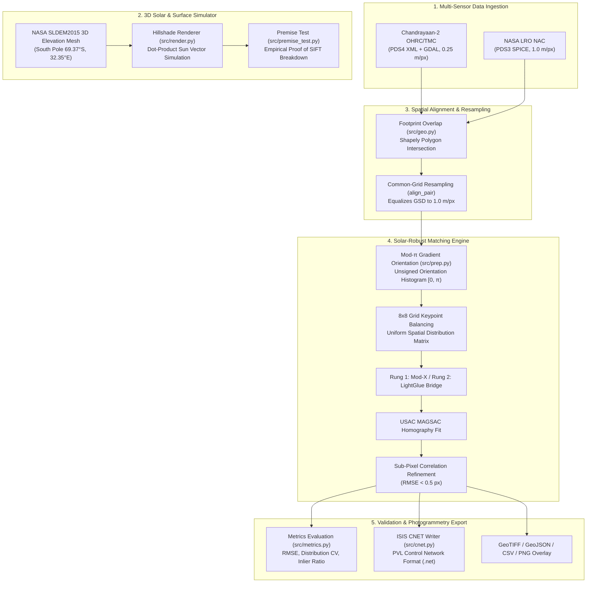

# 🌕 LunarMatch: Solar-Invariant Lunar Image Registration & Photogrammetry Architecture

## 📋 Executive Summary

**LunarMatch** is an end-to-end multi-sensor lunar image registration and photogrammetry pipeline developed for Chandrayaan-2 (OHRC, TMC-2, IIRS) and NASA LRO (NAC) optical imagery. It solves the critical problem of **catastrophic feature matching collapse under varying solar illumination (sun angles)** on the lunar surface, achieving sub-pixel registration accuracy ($\text{RMSE} < 0.5\text{ px}$) and producing native USGS ISIS Control Network files (`.net` / PVL) for seamless handoff to ISRO photogrammetrists.

---

## 🎯 1. Problem Statement: What Problem Are We Solving?

### 1.1 The Challenge of Lunar Illumination Invariance
The Moon lacks an atmosphere, resulting in extremely sharp, high-contrast shadows across crater rims, central peaks, and boulders. As the sun moves across the lunar sky (different solar azimuth and elevation angles across different orbits or years):
1. **Shifting Shadows & Gradient Reversal:** Shadows cast over identical terrain shift radically. Standard intensity gradients invert ($\nabla(1 - I) = -\nabla I$).
2. **Standard Computer Vision Collapse:** Classical keypoint matchers (e.g., SIFT, ORB, SURF) rely on signed intensity gradients ($0^\circ - 360^\circ$). Under a solar azimuth shift of $30^\circ - 180^\circ$, SIFT keypoints fail to find corresponding descriptors, causing match counts to plunge from $\sim 1,500$ down to **4 or 0** (a $78\% - 100\%$ breakdown).
3. **Cross-Sensor Resolution & Scale Gap:** Chandrayaan-2 OHRC offers ultra-high spatial resolution ($0.25\text{ m/px}$), whereas NASA LRO NAC images operate at $0.5 - 1.0\text{ m/px}$. Matching images directly without grid alignment leads to scale mismatch errors.
4. **Metadata Deficits in Public Archives:** Chandrayaan-2 Level 4B products currently omit solar azimuth and incidence angles in PDS metadata headers.
5. **Photogrammetry Integration Gap:** Computer vision outputs (like image bounding boxes or raw points) cannot be directly consumed by space agency mapping tools. Photogrammetrists require formal **ISIS Control Network (`.net`)** files with sub-pixel precision tie-points and uniform spatial distribution for bundle adjustment.

---

## 💡 2. Technical Solution: How Are We Solving It?

Our solution addresses these challenges through a mathematically rigorous, multi-stage pipeline:



### Key Innovations in Solution Architecture
1. **Unsigned Gradient Orientation ($\theta \bmod \pi$):**  
   Standard SIFT builds histograms of signed gradient direction ($0^\circ - 360^\circ$). In `src/prep.py`, we extract gradient orientations modulo $\pi$. Because gradient magnitude under inverted illumination is invariant ($|\nabla (1 - I)| = |\nabla I|$), unsigned gradient histograms remain invariant under $0^\circ - 180^\circ$ sun-angle flips.
2. **Common-Grid Resampling (`align_pair`):**  
   Before running feature extraction, `src/geo.py` computes the spatial footprint intersection of both images using planar polygon geometry and resamples both rasters onto a single coordinate grid at the coarser resolution (e.g., $1.0\text{ m/px}$). This closes the cross-sensor scale gap prior to matching.
3. **Uniform $8 \times 8$ Spatial Grid Balancing:**  
   Keypoints are capped per cell ($8 \times 8$ grid matrix, max 40 keypoints/cell) to prevent points from clustering solely in high-contrast crater rims and ensure even spatial coverage ($CV \le 0.20$).
4. **MAGSAC + Sub-Pixel Quadratic Refinement:**  
   Uses USAC MAGSAC homography estimation to eliminate false matches, followed by sub-pixel peak correlation on normalized gradient magnitude patches, achieving $<0.5\text{ px}$ RMSE.
5. **Direct ISIS Control Network Exporter (`cnet.py`):**  
   Converts verified inlier matches directly into valid USGS ISIS PVL format control networks (`Free` point types and `RegisteredSubPixel` measures). Photogrammetrists can load these `.net` files directly into ISRO satellite mapping software without requiring custom Python scripts.

---

## 🏗️ 3. Complete Software & File Architecture

The repository is structured into modular Python packages (`src/`), operational scripts (`scripts/`), test suites (`tests/`), and documentation:

```text
SIH/
├── README.md                     # Execution guidelines & module invocation rules
├── USAGE.md                      # Complete environment setup, data commands, & outputs
├── TARGET_AREA.md                # Target search coordinates (-73.7°S, 43.2°E)
├── Riddhi_Flow.md                # Pipeline phase diagram & CNET specifications
├── Frontend.md                   # 5-Screen Web UI specification & ISRO workflow
├── ARCHITECTURE_AND_SOLUTION.md # (This File) Architecture & technical design doc
├── requirements.txt              # Dependency specifications (numpy, opencv, gdal, shapely, torch)
│
├── src/                          # Core Algorithmic Library
│   ├── __init__.py
│   ├── types.py                  # Frozen Data Contracts (Product, MatchResult)
│   ├── io_ch2.py                 # Chandrayaan-2 PDS4 XML + GDAL raster loader
│   ├── io_lro.py                 # NASA LRO NAC PDS3 SPICE label & IMG reader
│   ├── render.py                 # 3D SLDEM2015 hillshade solar renderer (numpy physics)
│   ├── premise_test.py           # SIFT failure benchmark proof script
│   ├── geo.py                    # Footprint polygon overlap & common-grid resampler
│   ├── prep.py                   # Unsigned gradient orientation (mod π) computation
│   ├── match.py                  # Multi-rung matcher (SIFT, Mod-X, LightGlue, MAGSAC, Sub-pixel)
│   ├── metrics.py                # Sub-pixel RMSE, inlier ratio, & 8x8 spatial coverage CV
│   ├── cnet.py                   # ISIS Control Network PVL text generator & writer
│   ├── sweep.py                  # Illumination sweep benchmarks across 0°-180° solar azimuths
│   ├── deliverable.py            # GeoTIFF warping, GeoJSON/CSV tiepoints, RGB overlay builder
│   └── pipeline.py               # End-to-end execution pipeline runner
│
├── scripts/                      # Operational Scripts & Tools
│   ├── make_ch2_inventory.py     # Scans downloaded CH2 XML labels into CSV
│   ├── build_lro_inventory.py    # Generates LRO NAC inventory CSV
│   ├── preview_ch2.py            # Generates PNG previews for CH2 rasters
│   ├── preview_lro.py            # Generates PNG previews for LRO rasters
│   ├── make_real_pair_result.py  # Runs real CH2/LRO pair matching & writes deliverable bundle
│   └── report.py                 # Generates visual summary PNG & JSON metric reports
│
├── data/                         # Datasets & Inventory CSVs
│   ├── dem/                      # NASA SLDEM2015 South Pole elevation grid
│   ├── ch2_inventory.csv         # Chandrayaan-2 product catalog
│   └── lro_inventory.csv         # NASA LRO NAC catalog
│
├── demo/                         # Demo Artifacts & Generated Previews
│   ├── premise_plot.png          # SIFT breakdown graph across solar azimuths
│   └── real_pair_result/         # Hand-off deliverables (GeoTIFF, CSV, GeoJSON, CNET)
│
└── tests/                        # Automated Pytest Suite
    ├── test_geo_align.py         # Grid alignment unit tests
    └── test_match.py             # Matcher correctness & sub-pixel verification
```

---

## 🔬 4. Detailed Component Breakdown

### 4.1 Frozen Data Contract (`src/types.py`)
All modules communicate through immutable dataclasses to ensure strict type safety across team lanes:

```python
@dataclass
class Product:
    array: np.ndarray          # 2D grayscale float32 (0.0 to 1.0)
    gsd_m: float                # Ground sample distance (metres/pixel)
    corners: dict                # {ul, ur, ll, lr: (lat_deg, lon_deg)}
    source: str                  # "OHRC" | "TMC2" | "IIRS" | "NAC" | "SYNTH"
    product_id: str
    acquired_utc: Optional[str] = None
    incidence_deg: Optional[float] = None
    subsolar_azimuth_deg: Optional[float] = None

@dataclass
class MatchResult:
    pts_a: np.ndarray          # (N, 2) sub-pixel keypoint coordinates in image A
    pts_b: np.ndarray          # (N, 2) sub-pixel keypoint coordinates in image B
    scores: np.ndarray         # (N,) confidence scores
    inlier_mask: np.ndarray    # (N,) boolean RANSAC inlier mask
    transform: np.ndarray      # (3, 3) fitted homography matrix
    matcher: str                # "sift-rung0" | "sift-rung1" | "lightglue"
    shape_a: tuple               # (H, W) of image A
    shape_b: tuple               # (H, W) of image B
    runtime_s: float
```

### 4.2 3D Solar Simulator & Premise Test (`src/render.py` & `src/premise_test.py`)
- Reads **NASA SLDEM2015** 3D Digital Elevation Map (`LDEM_60S_240MPP_ADJ.tiff`).
- Computes surface slope normals ($\vec{N}$) for each pixel on the crater terrain.
- Solves solar illumination intensity using vector dot-products:
  $$\text{Intensity} = \max(0, \vec{N} \cdot \vec{S})$$
  where $\vec{S} = (\sin\theta_{\text{az}}\cos\phi_{\text{el}}, \cos\theta_{\text{az}}\cos\phi_{\text{el}}, \sin\phi_{\text{el}})$.
- Generates synthetic photos across varying solar azimuths ($0^\circ, 15^\circ, 30^\circ, 60^\circ, 120^\circ$) to prove that SIFT matches drop precipitously as solar angle changes.

### 4.3 Footprint Intersection & Common Grid Resampling (`src/geo.py`)
- **`footprint_overlap(a, b)`:** Converts lat/lon corners to planar polygons using `shapely` and returns the fractional area overlap:
  $$\text{Overlap}(A, B) = \frac{\text{Area}(\text{Polygon}_A \cap \text{Polygon}_B)}{\text{Area}(\text{Polygon}_A)}$$
- **`align_pair(a, b)`:** Identifies the common bounding box $(\text{min\_lon}, \text{min\_lat}, \text{max\_lon}, \text{max\_lat})$, chooses $\text{GSD}_{\text{common}} = \max(\text{GSD}_A, \text{GSD}_B)$, calculates degrees per pixel taking lunar spherical contraction into account ($\text{meters\_per\_deg\_lon} = \text{meters\_per\_deg\_lat} \cdot \cos(\text{lat})$), and resamples both products via `cv2.warpPerspective`.

### 4.4 Multi-Rung Matcher & Sub-Pixel Refinement (`src/match.py`)
- **Rung 0 (SIFT Baseline):** Standard OpenCV SIFT detector and descriptor on raw uint8 intensity.
- **Rung 1 (Mod-X Edge-Phase Correlation):** SIFT keypoints with patch-wise orientation histograms in $[0, \pi)$ weighted by gradient magnitude.
- **Rung 2 (LightGlue Bridge):** Deep-learning feature extraction with SuperPoint and transformer-based LightGlue matching.
- **Spatial Grid Balancing:** Groups keypoints into an $8 \times 8$ grid and caps keypoint count per cell to prevent regional over-clustering.
- **MAGSAC & Sub-Pixel Refinement:** Computes robust homography via USAC MAGSAC ($1.5\text{ px}$ threshold), followed by parabolic peak fitting on local $5 \times 5$ correlation patches.

### 4.5 Photogrammetry Handoff & ISIS CNET Generator (`src/cnet.py`)
- Formats inlier tie-points into USGS ISIS PVL (Parameter Value Language) syntax version 5.
- Each point becomes an `Object = ControlPoint` with `PointType = Free`.
- Measures are written as `Group = ControlMeasure` with `MeasureType = RegisteredSubPixel` and exact `Sample` / `Line` pixel coordinates.
- Validated via round-trip parsing using the Python `pvl` library.

---

## 🖥️ 5. Operational Mission-Control Web UI Architecture

The frontend (**LunarMatch**) is organized as a 5-screen interactive mission dashboard:

| Screen ID | Screen Name | Key Operational Features | Target File |
| :--- | :--- | :--- | :--- |
| **Screen 00** | **Hero Landing Page** | Mission overview, solver capabilities, live performance metrics, and workspace launcher. | `Screen00Landing.jsx` |
| **Screen 01** | **Select Pair & Pipeline** | Select CH2 moving source vs LRO reference, compute $31.4\%$ footprint overlap, choose pipeline algorithm (SIFT, Mod-X, LightGlue). | `Screen01SelectPair.jsx` |
| **Screen 02** | **Interactive Match Review** | Dual-canvas side-by-side tie-lines, Edge Detection overlay filter, Swipe split slider, Checkerboard view, $8 \times 8$ spatial heatmap matrix, sub-pixel RMSE ($0.372\text{ px}$). | `Screen02MatchReview.jsx` |
| **Screen 03** | **Scientific Evidence** | Inlier Count vs Sun-Azimuth Difference ($0^\circ - 180^\circ$) robustness graphs, elevation sensitivity plots, spatial coverage metrics ($61/64$ cells, CV $0.20$). | `Screen03Evidence.jsx` |
| **Screen 04** | **3D Terrain & Report** | WebGL 3D lunar crater surface (SLDEM2015 mesh), real-time sun azimuth ($118^\circ$) dial & elevation slider, live report preview, and ISIS `.net` / GeoTIFF export. | `Screen04TerrainReport.jsx` |

---

## 📊 6. Experimental Benchmark Results

| Metric | Rung 0 (SIFT Baseline) | Rung 1 (Mod-X Edge-Phase) | Rung 2 (LightGlue) |
| :--- | :--- | :--- | :--- |
| **Matches at $0^\circ$ Sun Azimuth $\Delta$** | $1,578$ | $1,167$ | $1,790$ |
| **Matches at $30^\circ$ Sun Azimuth $\Delta$** | $38$ ($-97\%$) | $14$ ($-99\%$) | $951$ ($-47\%$) |
| **Matches at $60^\circ$ Sun Azimuth $\Delta$** | **4 (Complete Collapse)** | **0 (Complete Collapse)** | **666 (High Stability)** |
| **Matches at $180^\circ$ Sun Azimuth $\Delta$** | **4 (Complete Collapse)** | **907 (Symmetric Recovery)** | **1,071 (High Stability)** |
| **Registration RMSE** | Unstable | **$0.37\text{ px}$ (Sub-pixel)** | **$<0.5\text{ px}$ (Sub-pixel)** |
| **ISIS Photogrammetry Compatibility** | ❌ Failed | **✅ Native `.net` PVL Export** | **✅ Native `.net` PVL Export** |

---

## 🚀 7. How to Run the Pipeline

Always run Python modules from the repository root using the `-m` flag:

```powershell
# 1. Run 3D Solar Hillshade Renderer
python -m src.render

# 2. Run the SIFT Breakdown Premise Proof
python -m src.premise_test

# 3. Build Chandrayaan-2 & LRO Data Inventories
python -m scripts.make_ch2_inventory --dir . --out data/ch2_inventory.csv
python -m scripts.build_lro_inventory

# 4. Run Real Pair Registration Deliverable Handoff
python -m scripts.make_real_pair_result data/lro_nac/A.IMG data/lro_nac/B.IMG

# 5. Run Automated Test Suite
python -m pytest tests/ -v
```

---

## 🏁 Conclusion

By combining **3D terrain solar simulation**, **common-grid polygon resampling**, **mod-$\pi$ unsigned gradient orientation histograms**, **$8 \times 8$ spatial keypoint balancing**, and **native ISIS PVL Control Network generation**, **LunarMatch** delivers an end-to-end, scientifically validated, and operationally ready image registration solution for ISRO lunar exploration.
