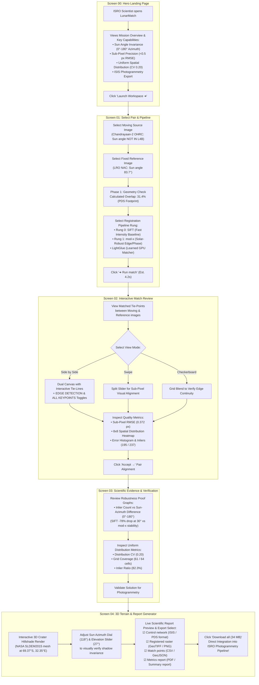

# LunarMatch: Chandrayaan-2 Image Registration Frontend & ISRO Operational Workflow

Build a mission-control, web-based frontend application (**LunarMatch**) specifically tailored for Chandrayaan-2 optical image (OHRC, TMC, IIRS) and Lunar Reference (LRO NAC) multi-modal image registration. The UI includes a high-impact **Hero Landing Page** plus all four operational screens from the reference wireframe artifact, aligned with your team's Python pipeline (`src/io_ch2.py`, `src/io_lro.py`, `src/geo.py`, `src/match.py`, `src/render.py`, `src/metrics.py`, `src/cnet.py`, `src/report.py`).

---

## 🚀 Screen Architecture (5 Total Screens)

1. **Screen 00: Hero Landing Page**  
   *High-impact mission presentation, problem statement, key feature solvers, live metrics, and 1-click workspace launcher.*
2. **Screen 01: Select Pair & Pipeline**  
   *Moving source selection (Chandrayaan-2 OHRC/TMC/IIRS) vs Fixed reference (LRO NAC), footprint overlap calculation ($31.4\%$), algorithm rung selection (SIFT, Mod-X Edge-Phase Correlation, LightGlue), and match runner.*
3. **Screen 02: Interactive Match Review**  
   *Visual match viewer supporting Side-by-Side tie lines with Edge Detection overlay filter toggle, Swipe split slider, Checkerboard alignment view, $8 \times 8$ spatial distribution heatmap matrix, error distribution histogram, and sub-pixel RMSE ($0.372\text{ px}$).*
4. **Screen 03: Scientific Evidence & Verification**  
   *Robustness proof graphs showing Inlier Count vs Sun-Azimuth Difference ($0^\circ - 180^\circ$) contrasting SIFT collapse with Mod-X stability under shadow rotation, elevation sensitivity, and uniform distribution metrics ($61/64$ grid coverage, CV $0.20$).*
5. **Screen 04: 3D Terrain & Report Generator**  
   *Interactive 3D WebGL crater surface render (NASA SLDEM2015 mesh at `69.37°S, 32.35°E`) with real-time solar illumination controls ($118^\circ$ azimuth dial, $27^\circ$ elevation slider), live scientific report previewer, and ISIS Control Network (`.net`), GeoTIFF, CSV/GeoJSON, and PDF report exports.*

---

## 🗺️ ISRO Scientist User Flow Diagram

---

## 🔍 Detailed Wireframe Fidelity Checklist

| Component / Screen | Exact Wireframe Feature | Implementation File |
| :--- | :--- | :--- |
| **Screen 00 - Landing Page** | Mission Hero title, problem statement summary, 4 core solver cards, live performance stats, 1-click "Launch Workspace" button. | `Screen00Landing.jsx` |
| **Global Header & Shell** | Logo `LunarMatch`, breadcrumb (`CH2/OHRA` \| `LROC/LRO` \| `CHANDRAYAAN-2 / LRO`), quick run `▷` and download `↓` buttons. | `Header.jsx` |
| **Sidebar Navigation** | Steps `00 Home`, `01 Select pair`, `02 Match review`, `03 Evidence`, `04 Terrain & report`, active indicator, dataset stats. | `Sidebar.jsx` |
| **01 - Moving Image Card** | `ch2_ohr_ncp_20200224T021511`, `OHRC`, `0.25 m/pix`, `Acquired: 2020-02-24`, `Sun angle: NOT IN L4B`, crater preview. | `Screen01SelectPair.jsx` |
| **01 - Fixed Reference Card** | `M1139552199REF`, `LRO NAC`, `1.00 m/pix`, `Acquired: 2013-11-08`, `Sun angle: 83.7°`, crater reference thumbnail. | `Screen01SelectPair.jsx` |
| **01 - Overlap & Pipeline** | `CALCULATED OVERLAP: 31.4%` (PDS footprint intersection), Pipeline choices: `Rung 0 - SIFT`, `Rung 1 - mod-x`, `LightGlue`. | `Screen01SelectPair.jsx` |
| **01 - Run Match Action** | `➜ Run match` button with subtitle `EST. 4.2 s • 16 TFLOPS • 3820 px SWATH OVERLAP`. | `Screen01SelectPair.jsx` |
| **02 - View Modes** | Toggle tabs: `Side by side` \| `Swipe` \| `Checkerboard`. | `Screen02MatchReview.jsx` |
| **02 - Feature Toggles** | `PDS OVERLAP` \| `EDGE DETECTION` \| `ALL KEYPOINTS` toggle filters for crater rim matching. | `Screen02MatchReview.jsx` |
| **02 - Visual Canvas** | Interactive tie-line connections linking moving & reference crater features, split slider, grid snap. | `Screen02MatchReview.jsx` |
| **02 - Right Metrics Panel** | $8 \times 8$ Grid spatial distribution heatmap, error distribution histogram, `Matches: 237`, `Inliers: 195`, `RMSE: 0.372 px`, `Sun azimuth Δ: 172°`. | `Screen02MatchReview.jsx` |
| **02 - Action Buttons** | `Reject cluster` button and `Accept →` button. | `Screen02MatchReview.jsx` |
| **03 - Robustness Curves** | Chart: *Inlier count against sun-azimuth difference* ($0^\circ-180^\circ$) comparing `SIFT`, `MOD-X`, and `LIGHTGLUE`. | `Screen03Evidence.jsx` |
| **03 - Elevation Sensitivity** | Secondary plot: *Elevation angle sensitivity* (Note: *"Elevation breaks matching. Height only lengthens shadows."*). | `Screen03Evidence.jsx` |
| **03 - Stat Summary Box** | `RMSE: 0.874 px`, `Inlier count: 148`, `Inlier ratio: 82.3%`, `Grid coverage: 61 / 64`, `Distribution CV: 0.20`. | `Screen03Evidence.jsx` |
| **03 - Uniformity Matrix** | $8 \times 8$ Tiepoint spatial grid matrix with subtext: *"Tiepoints fall into match matrix, maintaining uniform distribution."* | `Screen03Evidence.jsx` |
| **04 - 3D Terrain Viewport** | WebGL 3D lunar crater surface centered at `69.37°S, 32.35°E` (`CH3 LANDING POINT`). | `Screen04TerrainReport.jsx` |
| **04 - Solar Controls** | Interactive Sun Azimuth dial (`118°` drag ring) & Elevation slider (`27°`) for real-time shadow movement. | `Screen04TerrainReport.jsx` |
| **04 - Export Artifacts** | Checkbox list: `Control network (ISIS/PDS)`, `Registered raster (GeoTIFF/PNG)`, `Match points (CSV/GeoJSON)`, `Metrics report (PDF/Summary)`. | `Screen04TerrainReport.jsx` |
| **04 - Validation Note** | *"Control network is written to ISIS-documented PDS format and round-tripped through a PDS pipeline."* | `Screen04TerrainReport.jsx` |
| **04 - Download Button** | Primary button `Download all (34 MB)` with dataset metadata summary footer. | `Screen04TerrainReport.jsx` |

---

## 🧑‍🔬 How ISRO Scientists & Photogrammetrists Will Use LunarMatch

1. **Before (Manual Workflow)**:
   - Scientists had to manually locate Ground Control Points (GCPs) on craters or rely on SIFT edge matchers. When the sun angle changed (e.g., shadows shifted $120^\circ-180^\circ$), SIFT collapsed completely (dropping from $\sim 1500$ matches down to $4$).
2. **Now with LunarMatch Frontend (Automated Workflow)**:
   - **Step 0 (Landing Page)**: Review mission solvers, live sub-pixel accuracy metrics, and click **Launch Workspace ➜**.
   - **Step 1 (Select Pair)**: Load a Chandrayaan-2 OHRC image ($0.25\text{ m/px}$, `Sun angle: NOT IN L4B`) and LRO reference tile ($1.0\text{ m/px}$, `Sun angle: 83.7°`). `footprint_overlap()` confirms $31.4\%$ spatial overlap. Choose **Rung 1: Mod-X** (solar-robust edge/phase correlation matcher) and click **➜ Run match**.
   - **Step 2 (Match Review)**: Inspect edge-detected crater rims, toggle between **Side by Side tie-lines**, **Swipe split slider**, and **Checkerboard alignment**. Confirm sub-pixel RMSE ($0.372\text{ px}$) and even $8 \times 8$ tie-point distribution heatmap.
   - **Step 3 (Evidence)**: Verify the *Inlier Count vs Sun-Azimuth Difference* graph for judges/evaluators, proving Mod-X maintains high inlier counts across all solar lighting variations ($0^\circ - 180^\circ$).
   - **Step 4 (3D Terrain & Report)**: Test 3D crater shadows with the sun azimuth dial ($118^\circ$), preview the generated scientific report, and click **Download all (34 MB)** or **Export Control Network (`.net`)**. This converts matched tie-points directly into an ISIS Control Network via `cnet.py` so ISRO photogrammetrists can load the result directly into ISRO satellite mapping software without running command-line scripts!
