# Implementation Plan: Riddhi's Work Division — Evidence & Artifacts (Phases 9 – 13)

This implementation plan details **Riddhi's New Work Division** ("Evidence — every number and plot in the deck"). The objective is to turn all experimental results into the final scientific artifacts, plots, and tables needed for the hackathon slides and evaluation deck.

---

## 🗺️ Work Flow Diagram

```mermaid
flowchart TD
    subgraph P9["Phase 9: The Win Plot (demo/win_plot.png)"]
        W1["Update src/sweep.py<br/>Add rung parameter to make_dem_trial_fn()"] --> W2["Run illumination sweep for:<br/>• SIFT (rung=0)<br/>• mod-π / Mod-X (rung=1)<br/>• LightGlue"]
        W2 --> W3["Plot INLIER COUNT vs Sun Azimuth Difference (0°-180°)<br/>(Output to demo/win_plot.png)"]
    end

    subgraph P10["Phase 10: Refactor premise_test.py"]
        PR1["Refactor src/premise_test.py"] --> PR2["Call match.py (match(img1, img2, matcher, rung))<br/>instead of inline OpenCV SIFT"]
        PR2 --> PR3["Save headline plot to demo/premise_plot.png"]
    end

    subgraph P11["Phase 11: Metric Renaming in src/metrics.py"]
        M1["Rename 'rmse_fitted' -> 'reprojection_residual'"] --> M2["Make 'rmse_ground_truth' the headline metric"]
        M2 --> M3["Update tests & scripts/report.py"]
    end

    subgraph P12["Phase 12: Add Missing Unit Tests"]
        T1["Test 1: Azimuth drops faster than elevation"] --> T2["Test 2: Tiling correctness on repetitive terrain"]
    end

    subgraph P13["Phase 13: Final Presentation Metrics Table"]
        MT1["Script scripts/generate_final_metrics.py"] --> MT2["Output demo/final_metrics.json<br/>& Markdown/CSV slide tables"]
    end

    P9 & P10 & P11 & P12 & P13 --> SlideDeck["Presentation Slides & Deck Deliverables"]
```

---

## 📋 Phase-by-Phase Technical Breakdown

### Phase 9 — The Win Plot (`src/sweep.py` & `demo/win_plot.png`)
- **Objective**: Generate the centerpiece plot for the deck showing algorithm separation across illumination angles.
- **Technical Steps**:
  1. Update `make_dem_trial_fn(..., rung: int = 0)` in [`src/sweep.py`](file:///c:/Users/Riddhi%20Sharma/Desktop/Projects/SIH/src/sweep.py) to accept `rung` and pass it down to `match(base_img, test_img, matcher=matcher, rung=rung)`.
  2. Update `plot_sweep()` in `src/sweep.py` to support plotting **`inlier_count`** as the default metric (not ratio — 5/5 matches = ratio 1.0 is a false positive).
  3. Write `scripts/generate_win_plot.py` to execute sweeps for:
     - Baseline SIFT (`matcher="sift"`, `rung=0`)
     - Solar-Robust Mod-X / mod-π (`matcher="sift"`, `rung=1`)
     - Learned Matcher (`matcher="lightglue"`)
  4. Save multi-curve plot to `demo/win_plot.png`.

---

### Phase 10 — Refactor `premise_test.py` (`src/premise_test.py`)
- **Objective**: Ensure headline proof exercises our official pipeline instead of bypassing it with inline OpenCV code.
- **Technical Steps**:
  1. Create/refactor `src/premise_test.py` to import and call `src.match.match()` (`matcher="sift"`, `rung=0` vs `rung=1`).
  2. Evaluate rendered illumination pairs across rotating sun azimuths ($0^\circ, 15^\circ, 30^\circ, 60^\circ, 120^\circ, 180^\circ$).
  3. Prove SIFT inlier count collapses under shadow rotation while Mod-X remains stable.
  4. Save regenerated headline plot to `demo/premise_plot.png`.

---

### Phase 11 — Rename RMSE Metrics (`src/metrics.py`)
- **Objective**: Prevent fitted reprojection error from being mistaken for absolute ground truth accuracy.
- **Technical Steps**:
  1. In [`src/metrics.py`](file:///c:/Users/Riddhi%20Sharma/Desktop/Projects/SIH/src/metrics.py): rename `"rmse_fitted"` key in `rmse()` return dict to `"reprojection_residual"`.
  2. Make `"rmse_ground_truth"` the headline accuracy metric (falling back to `reprojection_residual` only when ground truth is unsupplied).
  3. Update [`scripts/report.py`](file:///c:/Users/Riddhi%20Sharma/Desktop/Projects/SIH/scripts/report.py) and unit tests (`tests/test_metrics.py`, `tests/test_report.py`, `tests/test_sweep.py`).

---

### Phase 12 — Add the Two Missing Unit Tests
- **Objective**: Validate physics assumptions and spatial grid balancing under edge cases.
- **Technical Steps**:
  1. **Azimuth vs Elevation Sensitivity Test** (`tests/test_sweep_extended.py`): Assert that sun azimuth rotation (shadow direction shift) causes a steeper, faster drop in match inlier count than sun elevation shift (shadow length change) under standard intensity matchers.
  2. **Tiling Correctness on Repetitive Terrain Test** (`tests/test_tiling.py`): Assert that `grid_balance_keypoints()` prevents keypoint clustering and degenerate homography fits when registering repetitive crater-field imagery.

---

### Phase 13 — Produce Final Presentation Metrics Table
- **Objective**: Create reproducible summary data for all slides.
- **Technical Steps**:
  1. Write `scripts/generate_final_metrics.py`.
  2. Run evaluation across test datasets for SIFT, Mod-X, and LightGlue.
  3. Compute:
     - Ground Truth RMSE ($px$)
     - Reprojection Residual ($px$)
     - Inlier Match Count
     - Inlier Ratio ($\%$)
     - Spatial Grid Coverage ($61/64$ cells) & Distribution CV ($0.20$)
  4. Output to `demo/final_metrics.json` and printable Markdown/CSV tables.

---

## 🎯 Definition of Done & Deliverables

- [x] `demo/win_plot.png` exists and shows two lines separating (SIFT collapse vs Mod-X/LightGlue stability).
- [x] `demo/premise_plot.png` regenerated using `match.py`.
- [x] `"rmse_fitted"` renamed to `"reprojection_residual"` in `src/metrics.py`.
- [x] `tests/test_sweep_extended.py` (azimuth vs elevation drop) passing.
- [x] `tests/test_tiling.py` (repetitive terrain grid balance) passing.
- [x] `demo/final_metrics.json` generated for slide presentation.
- [x] `pytest tests/` passes 100% cleanly.

